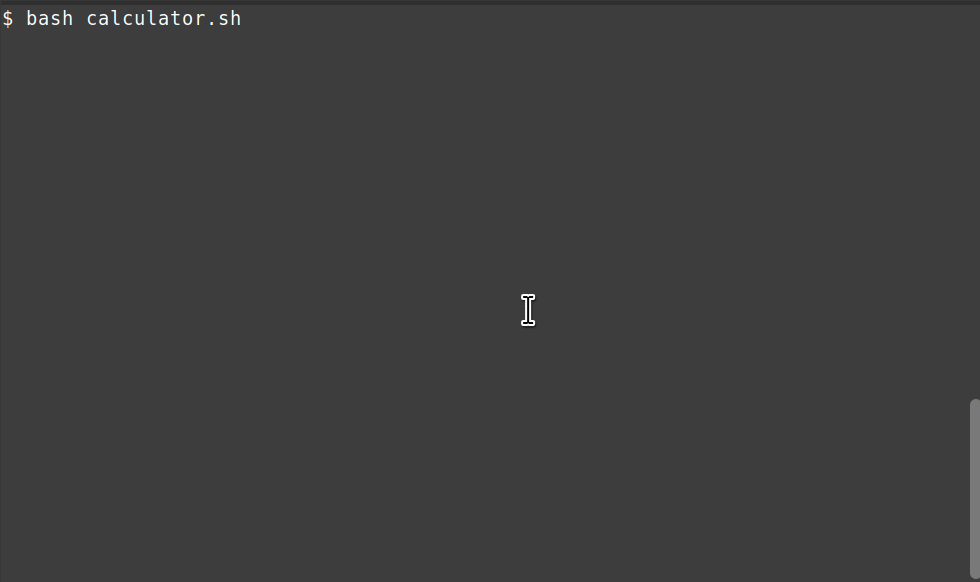

# Bash calculator

### What is this
A bash script calculator using Python as the backend.

It is written for a school assignment.

### How to use
Run this in the terminal
```
curl https://raw.githubusercontent.com/tylerlmz1/BC/master/calculator.sh > calculator.sh; bash calculator.sh
```
it will download the calculator.sh file and run it with bash

### Features
- [x] Addition (+)
- [x] Subtraction (-)
- [x] Multiplication (*)
- [x] Division (/)
- [x] Modulo (%)
- [x] Trigonometry (sin, cos, tan)
- [x] Floating point support
- [x] Saving input and answer to file by default

### GIF Preview


### Highlights
- It uses Python to do the math operations, so there's no need to painstakingly implement them with `bc --mathlib` or some other commands. Python is included in major Linux distributions so this is not a problem, the script will be terminated with an helpful error message in case Python is not installed.
- no need to choose what operation to do before you do it, all the operations are supported in one single prompt, so you could use the calculator with minimal friction.
